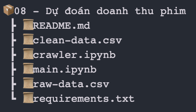

# HỆ THỐNG DỰ ĐOÁN DOANH THU PHIM ( KHOA HỌC DỮ LIỆU )

[](#contributors-)

[](https://www.codacy.com/gh/komkat-studio/happy-care-mobile/dashboard?utm_source=github.com&utm_medium=referral&utm_content=komkat-studio/happy-care-mobile&utm_campaign=Badge_Grade)


<table>
  <tr>
    <td align="center"><br /><sub><b>Trương Minh Đức - Huỳnh Thị Ái Linh - Trần Như Trí</b></sub></a><br /><a href="https://github.com/huynhthiailinh/data-science-predict-movie-sales" title="Code">💻</a> <a href="https://docs.google.com/document/d/1PdvJukU__2yzCiGH-0PRHPpFHP3JbxKL/edit#" title="Documentation">📖</a>
  </tr>
</table>


## **Hệ thống xây dựng chương trình dự đoán doanh thu phim bao gồm các bước**

- Crawl dữ liệu từ internet (data collection).
- Làm sạch dữ liệu (data cleaning).
- Xử lý dữ liệu, trích xuất đặc trưng (feature engineering, features selection).
- Mô hình hoá dữ liệu (modeling).

## Cấu trúc hệ thống



## Hướng dẫn chạy chương trình

* **Cài đặt môi trường**

```
~ git clone https://github.com/huynhthiailinh/data-science-predict-movie-sales.git
~ cd data-science-predict-movie-sales/08\ -\ Dự\ đoán\ doanh\ thu\ phim/
~ python -m venv venv
~ source ./venv/bin/activate
~ pip install -r requirements.txt
```

* **Crawl dữ liệu raw về local ( nếu chưa có file raw-data.csv )**

```
-> Chạy notebook crawler.ipynb
```

* **Chạy chương trình trong file *main.ipynb* và xem kết quả dự đoán trên tập test.**

```
-> Chạy notebook main.ipynb
```
